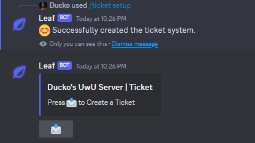
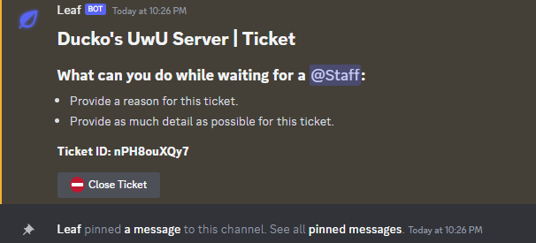
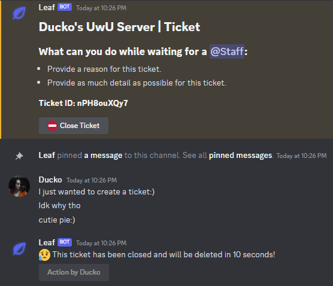
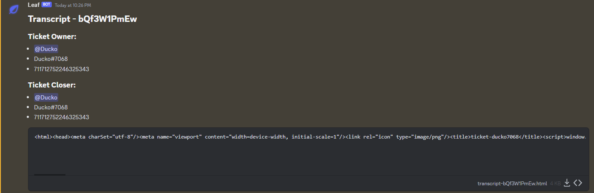
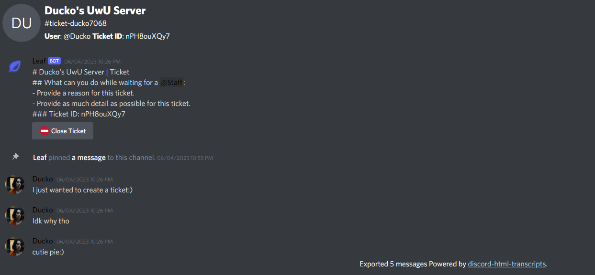

# Discord Ticket Bot - BETA

> If you need more information about these projects, go to [Project Discord's Page](https://github.com/SapphireDevs/project-discord)

This is a Discord.js bot developed by Sapphire Devs. It serves as a ticket system bot with additional features such as Discord sharding, slash command handling, event handling, error handling, and ticket management commands.

## Features

1. Discord Sharding (Discord-Hybrid-Sharding)
2. Slash Command Handling + SubCommand Handling
3. Event Handler
4. Simple Error Handling
5. Ticket Management Commands
6. Ticket Creation and Closing
7. Ticket Transcripts

## Technologies Used

The bot is built using the following technologies:

- [Node.js](https://nodejs.org)
- [TypeScript](https://www.typescriptlang.org/)
- [Prisma](https://www.prisma.io/)
- [Discord.js](https://discord.js.org/)
- [Discord Hybrid Sharding](https://www.npmjs.com/package/discord-hybrid-sharding)
- [Discord HTML Transcripts](https://www.npmjs.com/package/discord-html-transcripts)

## How to Contribute

If you have any improvements or suggestions, you are welcome to contribute to the project. Here's how you can do it:

1. Fork the project repository.
2. Make the desired changes or improvements.
3. Create a pull request with your changes.

## Join Sapphire Devs

You can join Sapphire Devs on the following platforms:

- [InstantGaming Referral](https://www.instant-gaming.com/?igr=sapphiredevs)
- [SapphireDevs Discord](https://discord.gg/rTT52gJC3J)
- [Personal Discord](https://discord.gg/TKz7BMwEap)

## Contributors

Thanks to the following contributors who have made this project possible:

---

Featured By Project Discord

## Images

Here are some screenshots showcasing the ticket system in action:

### Setting up the ticket system

### Creating a ticket

### Closing a ticket

### Getting the transcript

### Viewing the transcript

